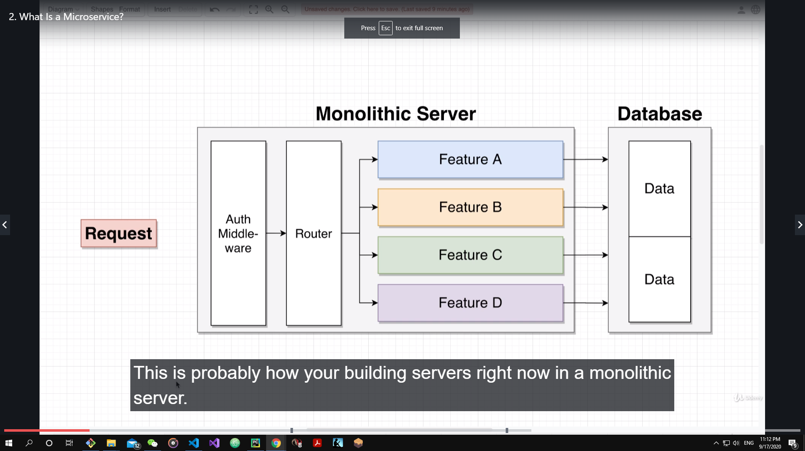
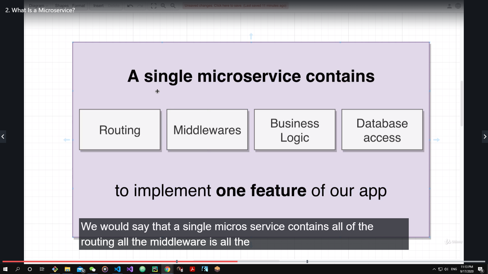
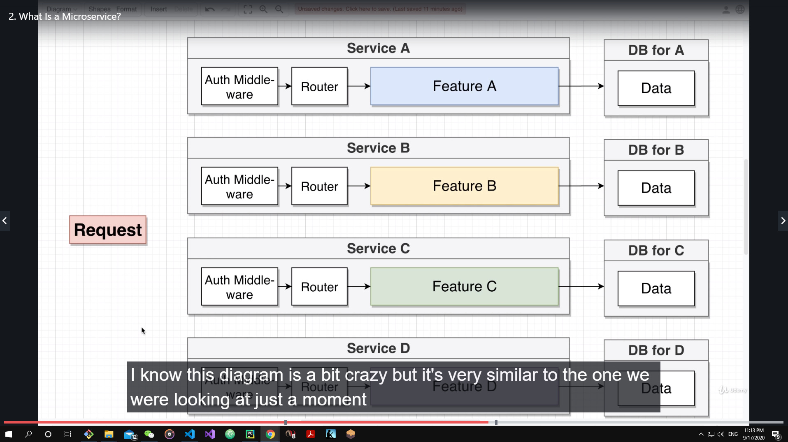
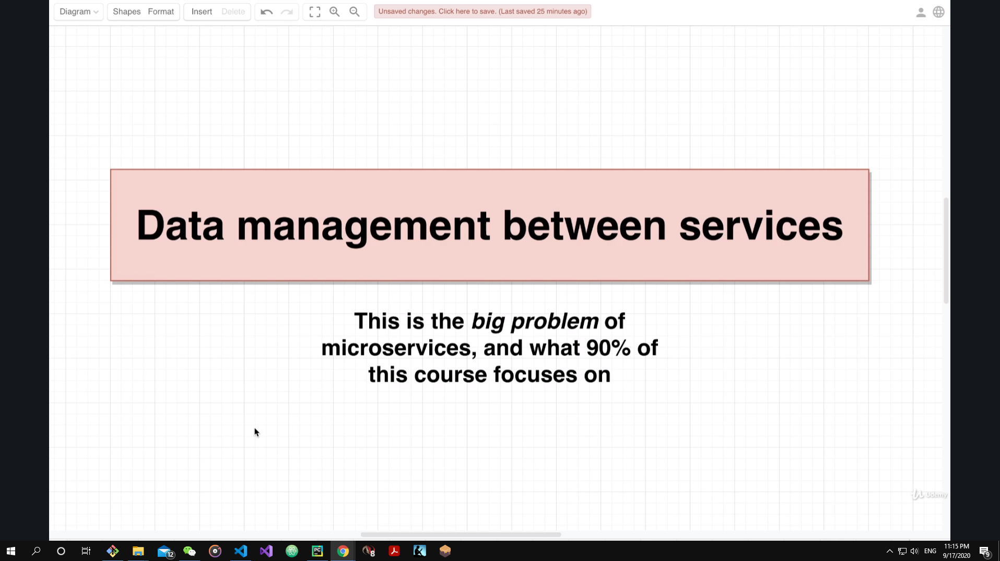

# Microservice 

This course introduces the concept of microservices and the application using Node.js and React.

This course can be found on Udemy, click the link here.

## What is Microservice 

From what we know about traditional structure, we have the monolithic server structure, as illustrated below:

In a monolithic server, we have our requests go through each the auth middleware, router, feature and then to the data. The problem is that if one feature is down, or something wrong with the database, 

and this is called the microservices

A single microservices contains 4 components:

* Routing 
* Middlewares
* Business Logic 
* Database Access 

All to, compare to the monolithic structure, implement ***one feature*** of our app. 

The following illustration can give a better understanding of this difference: 

Here the request will traverse each service, and each service is independent to each other to make sure, if others fail, it will keep working.

The reason to use microservices is simple, we tend to breakdown

The biggest problem in the microservices is the data management

